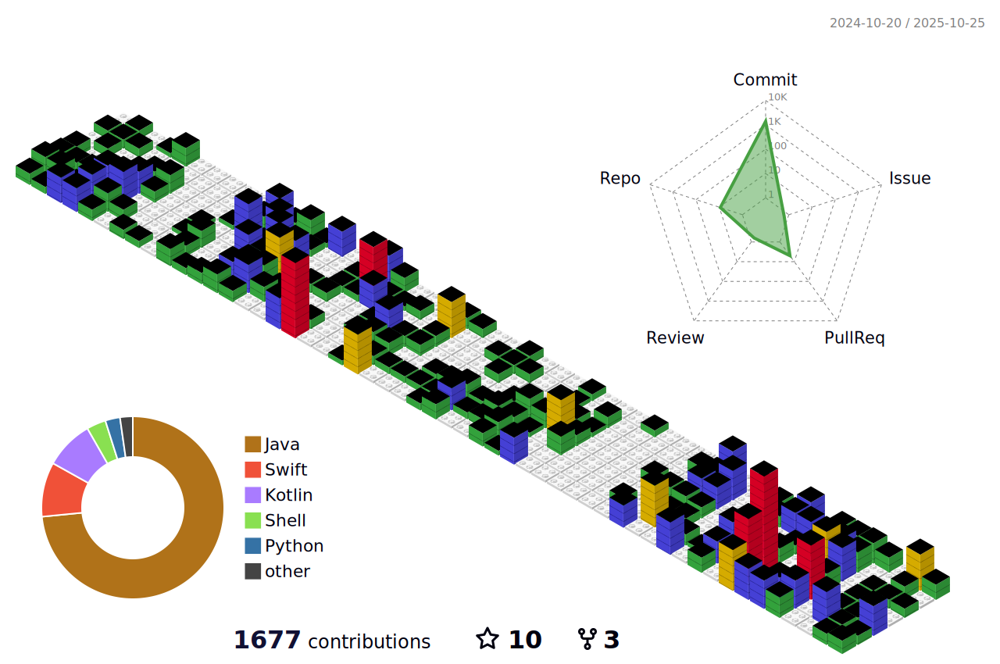

## 👋 Hi, I'm Rodrigo
💻 Backend-end Software Developer | 📱 Native Mobile Developer (Android & iOS)

I'm a Back-End Developer and Native Mobile Developer (Android & iOS). 
I have been working with Web Development since 2009 and with Mobile Development since 2011.

In my free time, I like read books and watch movies and series.

## 📚 Summary
- Graduated in Information Systems (Unigranrio)
- MBA in Software Architecture (FIAP)

## 👨🏽‍💻 Skills
<b> Languages: </b>

  
  
  
  
  
  
  
  
  
  
  
  
  

##

<b> Frameworks: </b>

  

  

  
  
  
  
  

  
  
  
  
  

  

##

<b> Mobile Development: </b>

  
  
  

##

<b> Databases: </b>

  

  

  

  

##

<b> Tools: </b>

  
  
  

  

  

  
  
  

  

##

<b> Devops: </b>

  

  
  
  

  

  

  

  

##

<b> Cloud: </b>

  

  

##

<b> Operating Systems: </b>

  

  

## 🖖 Where find me

 
	
	
  

## :bar_chart: Github Stats

  <a href="https://github.com/RodrigoAmora">
    <picture>
      <source media="(prefers-color-scheme: dark)" srcset="https://github-readme-stats.vercel.app/api?username=RodrigoAmora&show_icons=true&theme=dark&include_all_commits=true&count_private=true">
      <source media="(prefers-color-scheme: light)" srcset="https://github-readme-stats.vercel.app/api?username=RodrigoAmora&show_icons=true&theme=light&include_all_commits=true&count_private=true">
      
    </picture>
  </a>

  <a href="https://github.com/RodrigoAmora">
    <picture>
      <source media="(prefers-color-scheme: dark)" srcset="https://github-readme-stats.vercel.app/api/top-langs/?username=RodrigoAmora&layout=compact&langs_count=6&theme=dark">
      <source media="(prefers-color-scheme: light)" srcset="https://github-readme-stats.vercel.app/api/top-langs/?username=RodrigoAmora&layout=compact&langs_count=6&theme=light">
      
    </picture>
  </a>

  ##

  

    <picture>
      <source media="(prefers-color-scheme: dark)" srcset="https://raw.githubusercontent.com/RodrigoAmora/RodrigoAmora/output/github-contribution-grid-snake-dark.svg">
      <source media="(prefers-color-scheme: light)" srcset="https://raw.githubusercontent.com/RodrigoAmora/RodrigoAmora/output/github-contribution-grid-snake.svg">
      
    </picture>
  

  ##

  

    <picture>
      <source media="(prefers-color-scheme: dark)" srcset="./profile-3d-contrib/profile-night-green.svg">
      <source media="(prefers-color-scheme: light)" srcset="./profile-3d-contrib/profile-gitblock.svg">
      
    </picture>
  

<!--
|  |  |
| :-: | :-: | 

|  |  |  |
| :-: | :-: | :-: | 
-->
